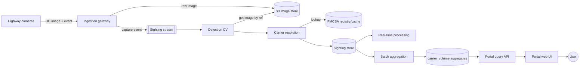
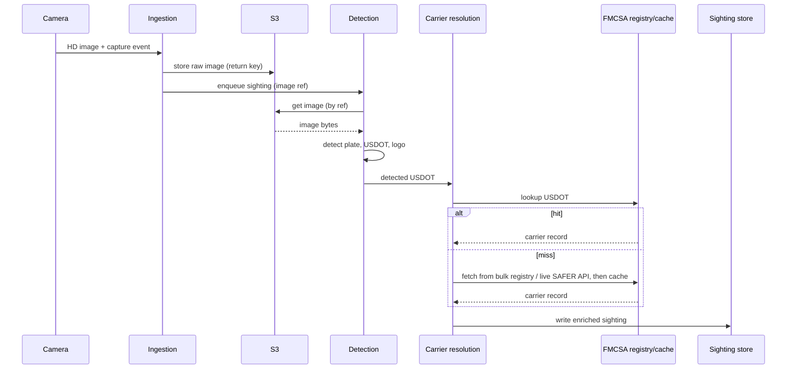
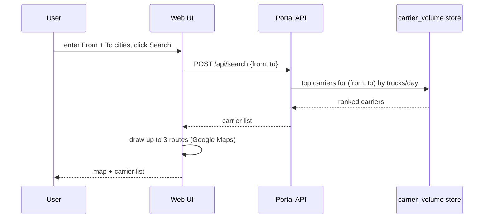
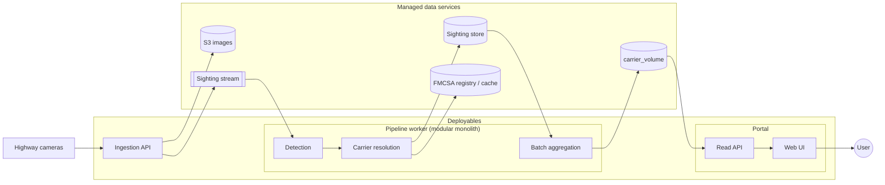
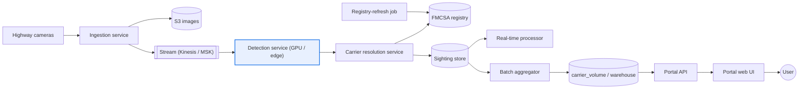

# Genlogs Platform Architecture

> Exercise deliverable #2. A high-level design: components, responsibilities, and data
> flow, with an MVP and a path to national scale. The portal slice (this repo's app) is one
> component of this larger platform. The data model is in `DATABASE.md` (#3).

## Overview
Genlogs tracks commercial trucks nationwide from highway cameras. Cameras capture HD images;
the platform detects license-plate characters, truck ID numbers, and company logos; resolves
the USDOT number to a carrier via FMCSA data; records each sighting; and aggregates sightings
into carrier-volume-by-lane data that powers the web portal (which carriers move the most
trucks between two cities).

The shape is a streaming-ingest + batch-analytics pipeline: a real-time path ingests and
enriches sightings (and is the basis for future live tracking), and a batch path builds the
aggregates the portal reads.

**Why this shape.** Three constraints drive it: the portal needs fast city-pair reads, so
carrier volumes are *pre-aggregated* by the batch path instead of computed from raw sightings
at query time; sightings are high-volume and append-only, so they flow through a *stream* into
cheap blob and columnar storage; and carrier resolution is kept *off the per-sighting hot path*
so an external FMCSA dependency can't throttle ingestion. Every section below serves one of
these three constraints.

## Components and responsibilities
1. **Capture / ingestion:** cameras capture HD images and emit capture events; an ingestion
   gateway writes raw images to object storage and sighting events to a stream.
2. **Detection (computer vision, CV):** runs detection per image (plate OCR, truck ID numbers, logos) with
   confidence scores.
3. **Carrier resolution / enrichment:** extracts the USDOT number and resolves it to a
   carrier/vehicle via the FMCSA registry (see Carrier data acquisition), with a cache.
4. **Sighting store:** persists enriched sightings (camera, time, vehicle, carrier, image
   reference).
5. **Processing:**
   - *Real-time path:* enriches and indexes sightings as they arrive (supports future live
     tracking).
   - *Batch path:* aggregates sightings into carrier-volume-by-origin/destination.
6. **Serving / portal:** the query API returns the highest-volume carriers between two cities
   (reading the batch aggregates) plus the web UI with map + carrier list. **This is the
   slice built in this repo.**

## Data flow

In the cloud-inference path, Detection reads each image back from S3 by its key — a claim-check,
since the stream carries the key, not the image bytes. With edge inference, detection runs
on-camera and that read goes away.

## Sequence: sighting pipeline

## Sequence: portal query

## Processing model: streaming + batch
Three decisions shape how the pipeline behaves and scales: its processing model (here), where
CV inference runs, and how carrier data is acquired.

- **Streaming** handles ingestion and per-sighting enrichment in near-real-time, and is the
  foundation for future live truck tracking.
- **Batch** rolls sightings into `carrier_volume` (carriers per origin/destination per
  period). **The portal's city-pair query reads these batch aggregates, not raw sightings,**
  so reads are fast and cheap.
- They reconcile through the shared sighting store: streaming writes sightings; batch reads
  them on a schedule.

## CV inference: edge vs cloud
- **Centralized cloud inference** (cameras upload images, cloud detects): simplest to build
  and iterate, but HD images from many cameras make upload bandwidth and storage the
  dominant cost, and add latency.
- **Edge inference** (cameras detect, send only metadata): drastically cuts bandwidth and
  storage and scales better, but needs capable camera hardware and edge model
  deployment/versioning.
- **Recommendation:** start cloud for the MVP (fastest to working, easiest to iterate on
  models), and move to edge/hybrid as camera count grows, since image egress is the cost
  that explodes with scale. Keep a sampled stream of raw images to S3 even with edge
  inference, for retraining and audit.

## Carrier data acquisition (USDOT to carrier)
Calling the live SAFER FMCSA service per sighting does not scale (rate limits, latency,
availability coupling). Strategy:
- **MVP:** on a new USDOT, call the SAFER / QCMobile API once and cache the result
  (DynamoDB/ElastiCache); repeat sightings hit the cache.
- **Scale (recommended):** maintain a local carrier registry seeded and periodically
  refreshed from FMCSA's existing bulk dataset (Motor Carrier Census / SAFER bulk files /
  Licensing & Insurance). Lookups hit the local registry, so there is no live dependency in
  the hot path.
- **Fallback:** if a bulk feed is missing or stale, scrape SAFER/USDOT records into the same
  registry on a schedule, respecting rate limits and terms of use.
- Net: the live API serves only cache misses / very fresh USDOTs; the durable answer is a
  refreshed local registry.

## MVP and scale path
Those three decisions set the rollout order: ship the simplest working version, then evolve
along the same axes as camera count grows.
- **MVP (pilot, tens of cameras):** cloud inference, live SAFER API + cache, a
  modular-monolith pipeline writing sightings to a managed DB, a scheduled job building
  `carrier_volume`, and the portal reading it. Single region.
- **Short term:** carrier resolution moves to the bulk FMCSA registry (off the live API); add
  observability and retries.
- **Medium term:** detection becomes its own service and shifts toward edge to cut image
  egress; ingestion scales out (Kinesis/MSK); aggregates move to a warehouse / fast read
  store; multi-AZ.
- **Long term (national):** edge inference standard; partitioned/time-series sightings;
  automated registry refresh; multi-region; image retention and cost controls.

## Deployment topology: monolith vs microservices
Packaging follows the same MVP→scale arc, but the monolith-vs-microservices call gets its own
section because it's the one teams most often over- or under-build. How the components are
*packaged into deployables* should change with scale, driven by the stages' very different
profiles: detection is GPU-bound, ingestion throughput-bound, carrier resolution cache-bound,
and the portal read-bound and independent of the pipeline's cadence.

**MVP layout (~3 deployables — a modular monolith for the pipeline):**
- **Portal** — static UI (S3 + CloudFront) plus a small read API. It only reads pre-computed
  `carrier_volume` aggregates, so it is already its own deployable. Keep it separate from day one.
- **Ingestion API** — a thin sync endpoint: accept camera uploads, write images to S3, put
  sighting events on the stream.
- **Pipeline worker** — one codebase/deployable with detection, carrier resolution, and batch
  aggregation as *internal modules*, consuming the stream and writing sightings and
  aggregates. A "modular monolith": clear module boundaries, single deploy.
- Plus managed data services (S3, stream, sighting store, registry/cache, aggregate store).

**Scale layout (decompose the worker along the stage seams):**
- **Detection service** — extracted first: GPU-bound, scales with image volume, and may move
  to SageMaker endpoints or edge inference; its hardware and cost curve diverge most from the
  rest.
- **Ingestion**, **carrier-resolution**, the **registry-refresh** job (scheduled bulk-FMCSA /
  scrape), the **stream/real-time processor**, and the **batch aggregator** each become
  independently deployed and scaled.
- **Aggregate store** and **portal API** scale for read load independently of the pipeline.
- Stages keep communicating over the stream/queues and shared stores — the seams already
  exist, so splitting is an ops change, not a rewrite.

> Detection (highlighted) is the first stage to split into its own service — GPU/edge-bound,
> with the most divergent scaling and cost curve.

**Tradeoffs**

| | Modular monolith (MVP) | Microservices (scale) |
|---|---|---|
| Velocity | High: one deploy, one local-dev story, no cross-service contracts | Lower early: contracts, versioning, more infra |
| Scaling | Stages scale together; can't tune GPU detection apart from light lookups | Each stage scales/optimizes independently |
| Fault isolation | A bad deploy or load spike hits the whole pipeline | Failures contained per service |
| Ops / observability | Minimal | Distributed tracing, retries, idempotency, more to monitor |
| Hardware heterogeneity | One runtime | GPU detection, edge, light lookups each on their own |

**Stance.** Start with a **modular monolith for the pipeline**, plus the already-separate
portal and a thin ingestion endpoint — resist a microservice fleet at the MVP, and equally
resist a true single binary that fuses the read-path portal with the write-path pipeline.
Enforce module boundaries that mirror the future service seams, and keep inter-stage
communication on the stream/store (not in-process calls) so those seams stay real. Then
**decompose by scaling pressure, not by fashion**: pull **detection** out first (GPU/edge, the
bottleneck), then ingestion and the registry-refresh job as camera count grows. Because the
stages already talk over a stream, splitting later is cheap.

## AWS service mapping (MVP tier)
| Component | AWS service(s) |
|---|---|
| Ingestion | AWS IoT / API Gateway to Kinesis Data Streams |
| Image storage | S3 (lifecycle policies) |
| Detection | ECS/Lambda (MVP), SageMaker or edge (scale) |
| Carrier resolution | Lambda/ECS + DynamoDB/ElastiCache cache |
| FMCSA registry | DynamoDB or Aurora/Postgres |
| Real-time processing | Kinesis Data Analytics / Lambda |
| Batch aggregation | Glue/EMR or scheduled jobs |
| Aggregate store | Aurora/Postgres or DynamoDB (Redshift at scale) |
| Portal API | App Runner / ECS / Lambda |
| Portal web UI | S3 + CloudFront |

## Cross-cutting concerns
- **PII / security:** license plates are personal data. Encrypt at rest and in transit,
  enforce least-privilege access, and limit/mask plate retention. Carrier/USDOT data is
  public, but linking it to movement is sensitive.
- **Data retention:** raw HD images are the biggest cost; keep short retention / sampling in
  S3, and retain derived sightings and aggregates longer.
- **Observability:** pipeline lag (stream to aggregate), detection accuracy/confidence,
  FMCSA/registry error and staleness rates, API latency.
- **Cost:** image egress and storage dominate, which is what drives edge inference and
  retention limits at scale.
