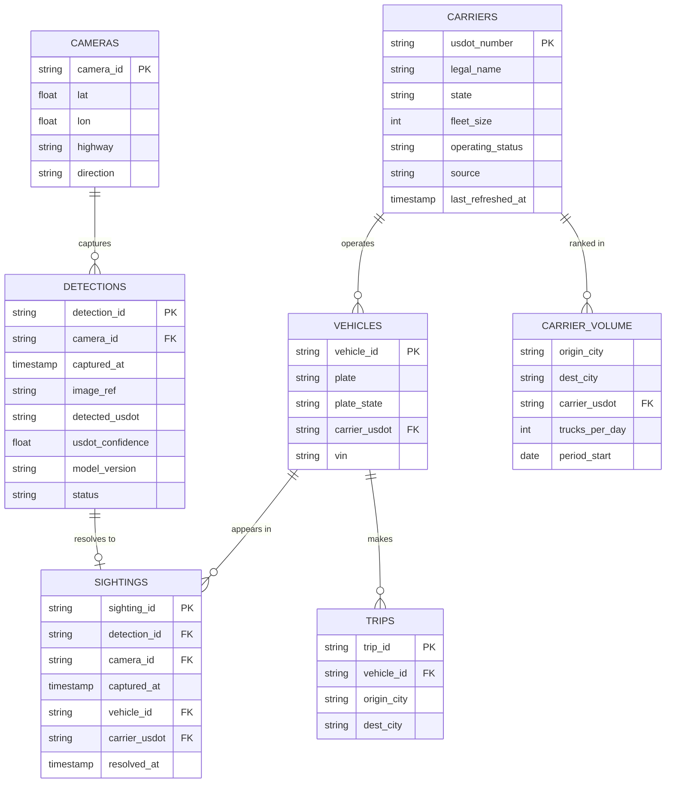

# Genlogs Platform Database Design

> Exercise deliverable #3. The analytical/operational data model behind the platform. The
> portal app itself uses no database (its carrier data is hardcoded per the spec); this is
> the platform-scale schema that the architecture (`ARCHITECTURE.md`) writes to and reads
> from.

**Design drivers.** The schema is shaped by the same constraints as the architecture: the
portal answers a single hot query — the top carriers between two cities — so that answer lives
in a pre-aggregated `carrier_volume` table rather than being computed at query time; a
**detection** is the raw, high-volume record of what the CV model read from each image
(plate/USDOT/logo + confidences; raw images stay in S3, only the key is stored), and a
**sighting** is the subset of detections that *resolved* to a known carrier; and the USDOT
number is the natural key threading sightings → vehicles → carriers → `carrier_volume`, with
the `carriers` table doubling as the local FMCSA registry that keeps resolution off the ingest
hot path. Every table below serves one of these.

## Core tables
- **cameras:** `camera_id` (PK), `lat`, `lon`, `highway`, `direction`, `status`,
  `installed_at`. The fixed roster of capture points.
- **detections:** `detection_id` (PK), `camera_id` (FK), `captured_at`, `image_ref` (S3 key),
  `detected_plate`, `detected_plate_state`, `detected_usdot`, `detected_logo`,
  `plate_confidence`, `usdot_confidence`, `logo_confidence`, `bbox`, `model_version`,
  `status` (pending | resolved | unresolved), `created_at`. The raw per-image CV output —
  what was read from the pixels, *before* resolution. The high-volume table; a detection may
  never resolve (no USDOT read, low confidence, or USDOT not in the registry).
- **sightings:** `sighting_id` (PK), `detection_id` (FK), `camera_id` (FK), `captured_at`,
  `vehicle_id` (FK), `carrier_usdot` (FK), `resolved_at`. A detection that resolved to a known
  vehicle/carrier — the enriched event the analytics build on. (`camera_id` and `captured_at`
  are denormalized from the detection so aggregation needs no join.)
- **vehicles:** `vehicle_id` (PK), `plate`, `plate_state`, `carrier_usdot` (FK), `vin`
  (nullable). Distinct trucks observed.
- **carriers:** `usdot_number` (PK, natural key), `legal_name`, `dba_name`, `state`,
  `fleet_size`, `entity_type`, `operating_status`, `source` (bulk | api | scrape),
  `last_refreshed_at`. The local FMCSA registry/cache.
- **carrier_volume:** `origin_city`, `dest_city`, `carrier_usdot` (FK), `trucks_per_day`,
  `period_start`, `period_end`, `computed_at`. PK (`origin_city`, `dest_city`,
  `carrier_usdot`, `period_start`). The batch aggregate the portal reads.
- **trips** (optional): `trip_id` (PK), `vehicle_id` (FK), `origin_city`, `dest_city`,
  `started_at`, `ended_at`. Movement inferred from sequential sightings of one vehicle;
  feeds `carrier_volume`.

## Relationships (ER diagram)
A camera produces many detections; each detection resolves to at most one sighting (or none);
a sighting ties to one vehicle, which belongs to one carrier; and `carrier_volume` ranks
carriers per city pair — all joined on the USDOT key.



## Portal query support
This is the one query the schema is built around. The portal's question — "which carriers move
the most trucks between city A and city B" — is answered by reading **carrier_volume**, the
pre-aggregated table built by the batch path, never by scanning the raw detection/sighting
tables:

```sql
SELECT carrier_usdot, trucks_per_day
FROM carrier_volume
WHERE origin_city = :from AND dest_city = :to
  AND period_start = :latest_period
ORDER BY trucks_per_day DESC
LIMIT 10;
```

Served by an index `(origin_city, dest_city, trucks_per_day DESC)` (the leading columns of
the PK plus the sort column), so the lookup is a direct range read, not a scan.

## Indexing, partitioning, retention
`detections` is the one table that grows without bound (one row per processed image), so it
drives most of these choices.
- **detections** is the high-volume table: time-partition by `captured_at` (daily/monthly)
  with a retention policy (archive or drop old partitions). Indexes: `(captured_at)`,
  `(camera_id, captured_at)`, `(detected_usdot)`, and `(status)` to sweep unresolved /
  low-confidence rows.
- **Raw images are not in the database.** They live in S3, referenced by `image_ref`; the
  table holds only the key plus the detected fields.
- **sightings** (the resolved subset) is far smaller: index `(carrier_usdot, captured_at)`
  for aggregation and `(detection_id)` for the back-reference to the raw detection.
- **carrier_volume:** PK/index on `(origin_city, dest_city, trucks_per_day DESC)` for the
  portal read.
- **carriers:** PK on `usdot_number`; index on `(last_refreshed_at)` to drive registry
  refresh.

## FMCSA registry modeling
The USDOT key has to resolve to a real carrier, which is why the **carriers** table doubles as
the local FMCSA registry/cache that backs carrier resolution:
- `usdot_number` is the natural key: detections carry the raw `detected_usdot`, and the
  resolved `carrier_usdot` flows through vehicles, sightings, and aggregates.
- `source` records provenance: `bulk` (from the FMCSA dataset), `api` (a live SAFER lookup),
  or `scrape` (the fallback).
- `last_refreshed_at` drives scheduled refresh and staleness checks, consistent with the
  acquisition strategy in `ARCHITECTURE.md` (live API only on a miss; bulk dataset as the
  primary registry).

## Storage technology mapping (by access pattern)
Each table goes to the store that fits how it's read and written:

| Table / data | Store | Why |
|---|---|---|
| carriers (registry), carrier_volume (aggregates) | Aurora/Postgres or DynamoDB | Fast point/range reads for the portal and resolution |
| detections (high-volume raw CV) | Partitioned Aurora, Redshift/time-series at scale | Append-heavy; raw output kept for audit + retraining |
| sightings (resolved events) | Partitioned Aurora/Postgres | Carrier-linked subset the aggregates roll up |
| raw images | S3 | Cheap blob storage, referenced by key |
| hot carrier cache | DynamoDB / ElastiCache | Low-latency lookups in the enrichment hot path |
